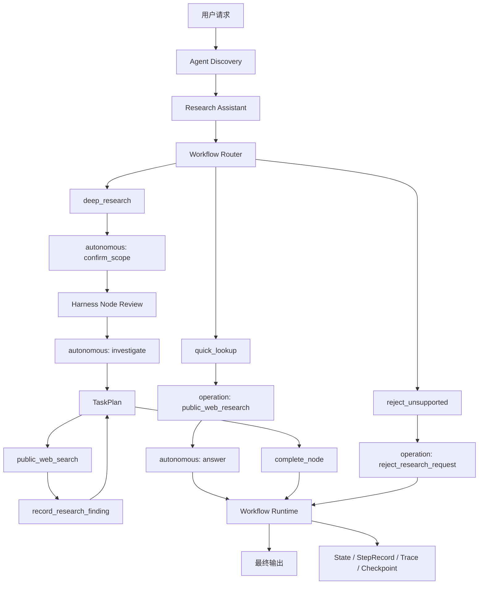
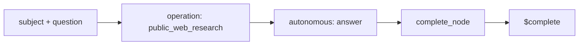
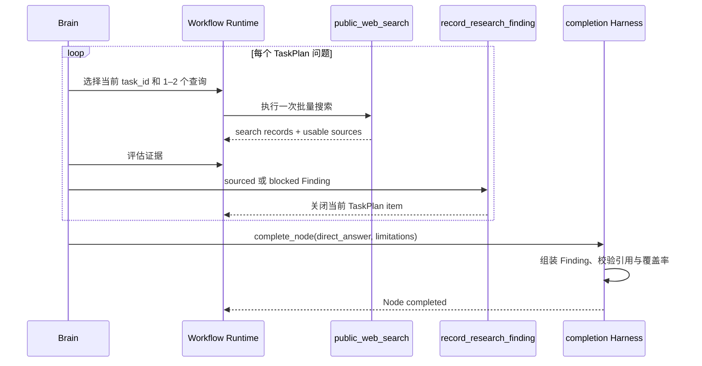

# Research Assistant 技术架构

本文描述 `research-assistant` 当前版本的核心方案、执行边界和扩展方式。它是实现基线，不记录历史迁移过程，也不承诺尚未实现的数据源、知识库、图谱或通用研究平台能力。

## 1. 目标与边界

Research Assistant 解决的是公开资料研究，而不是通用聊天或通用工具执行。当前版本覆盖三类请求：

- 明确、狭窄、一次检索通常能够回答的查询；
- 需要比较、评估、尽调或多问题综合的深度研究；
- 天气、翻译、编码、提醒和网页操作等非研究请求的明确拒绝。

系统追求的不是让模型自由生成任意流程，而是把稳定控制权和局部自主能力分开：

> Workflow 管理稳定业务主航道，AgentLoop 只在一个 Autonomous Node 内自主解决问题。

当前明确不做私域知识库、实体图谱、付费搜索 API、动态子图编译、并行 Workflow Node、跨 Workflow 跳转和多层嵌套 Workflow。

## 2. 核心设计原则

### 2.1 单一 Agent，多个 Workflow

`research-assistant` 是一个 Agent，不是三个独立 Agent。它声明三个 Workflow，由 Router 根据用户请求选择唯一入口。Agent 共享同一组指令、Skill、Operation 和权限边界，Workflow 决定具体执行路径。

### 2.2 两种 Node 执行方式

- `operation`：Runtime 已经知道要执行哪个可信 Operation；模型不参与操作选择。
- `autonomous`：Workflow 只规定目标、输入、能力和完成契约；AgentLoop 在节点内部逐步规划和执行。

模型可以选择当前自主节点内的下一步，但不能修改 Workflow、节点目标、工具范围、Schema、预算或后续迁移。

### 2.3 搜索不等于研究完成

`public_web_search` 只产生候选来源和可用网页内容。只有 `record_research_finding` 能关闭一个研究问题，并把结论、影响、置信度和逐项证据绑定到对应 `task_id`。

这条边界防止“调用过搜索工具”被误判成“问题已经解决”。

### 2.4 模型提出完成，Harness 决定完成

模型通过 `complete_node` 提交候选结果。Harness 负责：

1. 校验 Node 输出 Schema；
2. 检查必填字段是否有意义；
3. 确认 TaskPlan 没有开放问题；
4. 验证引用确实来自当前问题观察到的可用来源；
5. 从已记录 Finding 组装最终关键发现和引用；
6. 写入 Workflow State 并执行稳定迁移。

模型不能绕过这些检查。

## 3. 总体架构



组件职责如下：

| 组件 | 负责 | 不负责 |
| --- | --- | --- |
| `agent.toml` | 声明 Agent factory，供 CLI 和 Discovery 定位 | Workflow 和运行逻辑 |
| `agent.py` | 组装 Agent、Workflow、Skill、Operation 和权限 | 节点调度 |
| Router | 选择一个已声明 Workflow，并构造合法输入 | 回答用户、调用研究工具 |
| Workflow Runtime | 执行 Node、迁移、预算、校验和持久化 | Operation 内部搜索算法 |
| AgentLoop / Brain | 在一个 Autonomous Node 内决定下一步 | 修改主 Workflow |
| Research Operations | 搜索、抓取、记录 Finding 或拒绝请求 | 决定跨节点流程 |
| CLI Renderer | 展示必要交互和进度 | 作为事实日志 |
| Trace | 记录完整执行证据 | 作为 Agent Memory |

## 4. Agent 定义与发现

### 4.1 `agent.toml`

```toml
factory = "agent:build_agent"
```

它告诉 Discovery：从当前 Agent 包的 `agent.py` 导入 `build_agent()`。CLI 执行 `modi research-assistant` 时，首先通过这个声明找到 Agent。

### 4.2 `agent.py`

`build_agent()` 是组合根，负责构建完整 `ModiAgent`：

- 名称、描述和统一 Agent 指令；
- `web-research` Skill；
- 三个 YAML Workflow；
- 四个可信 Operation；
- Permission Profile。

Workflow YAML 在加载时即校验：引用的 Operation 必须属于 Agent，输入和完成 Schema 必须合法。运行时不会临时发现未知工具。

## 5. Router 与三个 Workflow

当调用方未指定 `workflow_id` 且 Agent 声明多个 Workflow 时，模型 Router 只能调用一个形如 `route__<workflow_id>` 的路由工具。每个工具的描述和输入 Schema 直接来自对应 Workflow。Router 的输出必须满足：

- 恰好选择一个已声明 Workflow；
- 参数是对象；
- 参数通过选中 Workflow 的 `input_schema`。

Router 不回答问题，也看不到研究 Operation。

| Workflow | 适用请求 | 主路径 |
| --- | --- | --- |
| `quick_lookup` | 明确实体或窄问题，一次检索通常足够 | Search Operation → Autonomous Answer |
| `deep_research` | 比较、评估、尽调、技术实力、风险和多维综合 | Scope → Review → TaskPlan Investigation |
| `reject_unsupported` | 非公开资料研究任务 | Deterministic Reject Operation |

调用方也可以显式传入 `workflow_id`。Checkpoint resume 始终沿用首次选中的 Workflow，不能在恢复时换路。

## 6. Quick Lookup



`search` 是确定性 Operation Node，只执行一次 `public_web_research`。它做严格实体检索、候选排序和少量页面抓取。

`answer` 是无工具 Autonomous Node。它只能依据上一步的 `research_result` 生成：

- `executive_summary`；
- `citations`；
- 可选 `limitations`。

这种拆分让检索行为稳定，同时保留模型对检索结果的自然语言归纳能力。

## 7. Deep Research

### 7.1 Scope 确认

`confirm_scope` 是无工具 Autonomous Node。它把用户请求转换为：

```yaml
subject: 研究主体
research_question: 用户真正需要判断的问题
task_plan:
  items:
    - id: stable_task_id
      title: 可独立关闭的研究问题
```

TaskPlan 必须包含 2–4 个互不重叠、能够直接支撑最终判断的问题。`completion.review: required` 表示模型提交草案后，Harness 创建 Node Review Interaction，由用户选择开始、修改或取消。

确认是 Workflow 控制行为，不由模型额外调用一次 `request_user_input`。

### 7.2 Investigation 循环



每个 TaskPlan 问题当前最多调用一次 `public_web_search`，一次调用可包含 1–2 个互补查询。查询和 provider 请求在 Operation 内部并行，Workflow 本身没有并行 Node。

Finding 有两种状态：

- `sourced`：有来自当前问题可用来源的证据；
- `blocked`：有限公开搜索无法形成可靠结论。

`blocked` 不会让整个研究立即失败。Runtime 将该问题关闭为 `[limited]`，继续研究后续问题，并在最终结果中生成明确限制。用户可以在最终报告后提供新线索，再发起增量研究。

### 7.3 预算与唯一收尾步骤

TaskPlan 存在时，Runtime 根据问题数量扩大 Autonomous Node 的合理步数预算：

```text
max(configured_max_steps, task_count × 4 + 4)
```

如果最后一个 Finding 恰好在上限步骤关闭计划，Runtime 只额外保留一个 completion step。此时所有普通工具从 Brain 的可用能力中移除，只允许综合已有 Finding 并调用 `complete_node`。

这避免 `4/4` 后出现 `max_auto_steps_reached`，同时不会把开放计划变成无限续步。

## 8. 公网搜索 Operation

当前搜索不依赖付费 API 或 API Key，而是并行访问三个公开入口：

- Bing RSS；
- 百度 HTML 搜索；
- DuckDuckGo HTML，失败时回退到 DuckDuckGo Lite。

这意味着当前方案没有搜索 API 费用，但公开网页不是稳定的官方自动化接口，可能出现限流、验证码、页面结构变化或服务条款限制。生产环境若要求稳定 SLA，应替换为正式授权的搜索 API；这一替换只影响 Operation 实现，不改变 Workflow 协议。

### 8.1 有界检索

| 限制 | 当前值 |
| --- | --- |
| 每个 deep research 问题的查询数 | 1–2 |
| 每个 provider 返回的候选数 | 最多 4 |
| 候选页面抓取尝试 | 最多 5 |
| 最终可用来源 | 最多 3 |
| `public_web_search` 每个 task 的调用次数 | 1 |

搜索响应将 provider 状态区分为 `ok`、`empty`、`blocked` 和 `failed`。只有 `ok` 与 `empty` 表示 provider 给出了健康响应；“没有结果”和“服务不可用”不能混为一谈。

### 8.2 两种搜索语义

- `public_web_research`：面向明确主体，强调实体名称匹配，用于 Quick Lookup。
- `public_web_search`：面向一个研究问题，允许更宽的主题发现，用于 Deep Research。

若查询本身是公开 HTTP(S) URL，`public_web_search` 可以直接抓取该 URL，而不经过搜索 provider。

## 9. Evidence Ledger

Research Assistant 没有单独引入新的 Evidence Graph 对象。证据账本由现有运行记录组成：

```text
RuntimeOperation output
  + StepRecord
  + TaskPlan item
  + recorded Finding
  = 可审计的研究证据链
```

`record_research_finding` 记录：

- `task_id` 与研究问题；
- 直接结论；
- 对用户判断的意义；
- `high` / `medium` / `low` 置信度；
- `sourced` / `blocked` 状态；
- claim-level evidence；
- 限制条件。

每条证据包含 `claim`、`source_url`、`source_type` 和可选 `as_of`。来源类型包括官方、一手来源、可信媒体、行业报告、招聘样本和二手来源。

Runtime 强制以下不变量：

1. Finding 引用必须来自同一 `task_id` 已观察到的可用来源；
2. 每个已解决问题必须存在对应 Finding；
3. 最终关键发现必须与记录的 Finding 内容一致；
4. 最终引用必须精确等于各 Finding 实际使用来源的并集；
5. Limited 问题不能伪造引用，且必须生成最终限制。

因此，Brain 负责判断和表达，Harness 负责证据归属与完整性。

## 10. `complete_node` 与最终结果组装

Deep Research 的模型最终只提交：

```yaml
direct_answer: 对用户问题的直接综合回答
limitations:
  - 总体限制
```

Harness 从已记录 Finding 自动加入：

```yaml
key_findings:
  - task_id
    question
    conclusion
    implications
    confidence
    status
    evidence
citations:
  - https://...
```

这避免模型在收尾时重新抄写 Finding，导致结论、引用或置信度漂移。CLI 再将引用编号放到对应 evidence claim 旁边，而不是只在末尾输出无关联 URL 列表。

## 11. 状态、Checkpoint 与 Trace

Workflow State 持久化当前节点、节点尝试、Node 输出、迁移、AgentLoop 状态、StepRecord、TaskPlan、Pending Operation 和人工输入。恢复运行时会检查：

- Workflow ID 未变化；
- Workflow definition fingerprint 未变化；
- Execution Contract fingerprint 未变化。

Trace 记录完整执行事实，包括 Workflow 选择、Node、Operation、Step、completion rejection、interaction、TaskPlan 更新和 terminal 状态。CLI 只展示用户需要理解的子集。

```python
response = session.run_task(
    agent="research-assistant",
    input={"prompt": "对比零跑和理想汽车"},
    thread_id="auto-compare-001",
)

for event in session.get_trace("auto-compare-001"):
    print(event["event_type"], event["payload"])
```

Trace 是审计和调试证据，不是 Agent Memory，也不会自动进入下一次模型上下文。

## 12. CLI 交互模型

Deep Research CLI 有意隐藏内部噪声，只展示：

1. 一个 `Research scope` 框；
2. 框下方的确认输入；
3. 确认后由同一个框原位更新研究问题状态；
4. 最终报告。

Scope 输入期间使用静态 Panel，避免 Rich Live 与终端输入争夺光标。用户确认后，Renderer 清除静态预览并由唯一 Live 原位接管。Spinner 只存在于执行阶段。

任务标记语义：

- `○`：待处理；
- `●`：研究中；
- `✓`：有证据完成；
- `△`：有限证据完成，最终保留限制。

Operation 名称、查询词、模型 narration 和 completion repair 仍在 Trace 中，但不作为用户进度重复打印。

## 13. 执行方式

### 13.1 CLI

```bash
modi research-assistant
```

### 13.2 Python API

```python
response = session.run_task(
    agent="research-assistant",
    input={"prompt": "威灿科技"},
    thread_id="company-lookup-001",
)
```

需要确定性选择 Workflow 时可以显式指定：

```python
response = session.run_task(
    agent="research-assistant",
    workflow_id="quick_lookup",
    input={
        "subject": "威灿科技",
        "question": "威灿科技的主营业务是什么？",
    },
    thread_id="company-lookup-002",
)
```

Node Review 返回 waiting 后，通过同一个 `thread_id` 恢复：

```python
response = session.respond_to_interaction(
    thread_id="auto-compare-001",
    interaction_id=interaction_id,
    decision="approved",
)
```

## 14. 如何扩展

### 14.1 增加 Workflow

在 `agents/research_assistant/workflows/` 增加 YAML，并确保：

- `description` 能让 Router 与现有 Workflow 明确区分；
- `input_schema` 足够严格；
- 每条迁移都指向已声明 Node、`$complete` 或 `$fail`；
- 使用的 Operation 已由 Agent 绑定。

如果两个 Workflow 描述重叠，Router 的不确定性会直接变成产品行为问题，因此应优先收紧路由边界，而不是增加复杂分类代码。

### 14.2 增加 Node

确定性步骤优先使用 `operation` Node；只有“目标稳定、解决路径不确定、确实需要多步规划”的复合步骤才使用 `autonomous` Node。

Autonomous Node 至少需要：

- 清晰目标；
- 输入引用；
- 最小完成 Schema；
- 显式工具白名单；
- 合理 `max_steps`；
- `completed` 和 `failed` 迁移。

不要为 LLM 调用、人工交互或验证单独发明 Node 类型。它们可以由 Operation 或 Autonomous Node 内的现有协议承载。

### 14.3 增加 Operation

Operation 由 JSON Schema、风险等级、副作用、幂等性、调用预算和 handler 组成。新增搜索 provider 时，优先修改搜索 Operation 内部实现；只有产生新的稳定业务语义时才新增 Workflow Operation。

## 15. 失败与恢复语义

| 情况 | 行为 |
| --- | --- |
| 单个 provider blocked/failed | 其他 provider 继续；结果记录 limitation |
| 至少两个 provider 健康但无证据 | 问题可记录为 limited，不推断主体不存在 |
| 可用 provider 不足 | 标记搜索不可判定，而不是“没有结果” |
| Finding 引用未被当前 task 观察 | Operation 失败，Agent 在预算内修复 |
| `complete_node` Schema 或证据校验失败 | completion rejected，反馈给 AgentLoop |
| TaskPlan 尚有开放问题 | 拒绝完成 |
| 最后问题在步数上限关闭 | 仅保留一个 completion-only step |
| 开放计划耗尽步数 | `max_auto_steps_reached`，沿 failed transition |
| 用户修改 Scope | 保存反馈，同一 Checkpoint 重新规划 Scope |
| 用户取消 | Workflow cancelled |

## 16. 测试策略

当前测试重点覆盖：

- Agent discovery、Workflow 数量和 Operation 绑定；
- Router 对简单、深度和非研究请求的选择；
- Scope Review、修改和恢复；
- 多问题 TaskPlan 的逐项关闭；
- 搜索调用预算和 provider 隔离；
- Finding 引用必须来自已观察来源；
- Harness 自动组装最终 Findings 和 citations；
- Limited 问题继续执行并进入最终限制；
- 第 20 步关闭最后问题、第 21 步仅完成节点的边界；
- 单框 CLI Live 生命周期和隐藏噪声；
- Trace、Checkpoint 和 terminal 状态。

新增能力时，应优先增加端到端 Agent 回归，再补 Runtime 的不变量单测。仅测试模型输出文本不能证明 Workflow、证据和恢复语义正确。

## 17. 关键文件

| 文件 | 作用 |
| --- | --- |
| `agents/research_assistant/agent.toml` | Agent factory 声明 |
| `agents/research_assistant/agent.py` | Agent 组合根 |
| `agents/research_assistant/workflows/*.yaml` | 三个稳定 Workflow |
| `agents/research_assistant/tools/research.py` | 搜索、Finding 和拒绝 Operation |
| `agents/research_assistant/skills/web-research/SKILL.md` | 模型研究方法与约束 |
| `src/modi_harness/workflow/router.py` | Workflow 选择与输入校验 |
| `src/modi_harness/workflow/runtime.py` | Node、TaskPlan、completion 和迁移语义 |
| `src/modi_harness/workflow/session.py` | Session、Checkpoint、Stream 和 Trace |
| `src/modi_harness/cli/renderer.py` | 单框 CLI 进度展示 |

## 18. 结论

当前 Research Assistant 的核心不是“会调用搜索工具的聊天机器人”，而是一套受 Workflow 约束、以 TaskPlan 组织问题、以 Finding 固化证据、由 Harness 决定完成的研究执行协议。

它保留了 Agent 对研究路径、查询改写和综合判断的自主性，同时把路由、权限、预算、证据归属、状态恢复和完成条件放在确定性 Runtime 中。这正是使用 Harness 而不是直接调用通用 Chat 模型的主要价值。
