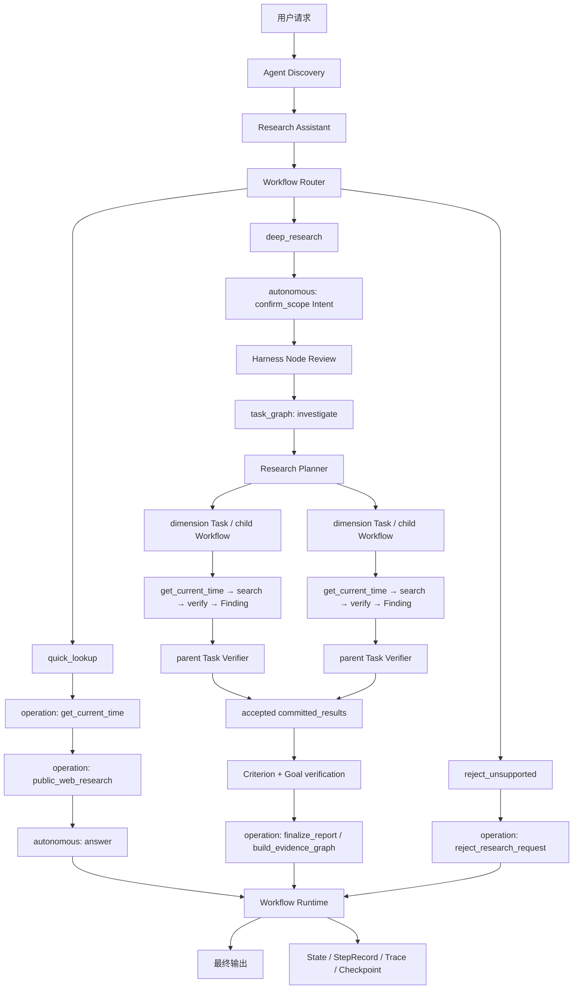
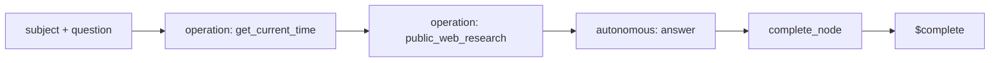

# Research Assistant 技术架构

本文描述 `research-assistant` 当前版本的核心方案、执行边界和扩展方式。它是实现基线，不记录历史迁移过程，也不承诺尚未实现的数据源、知识库、图谱或通用研究平台能力。

## 1. 目标与边界

Research Assistant 解决的是公开资料研究，而不是通用聊天或通用工具执行。当前版本覆盖三类请求：

- 明确、狭窄、一次检索通常能够回答的查询；
- 需要比较、评估、尽调或多问题综合的深度研究；
- 天气、翻译、编码、提醒和网页操作等非研究请求的明确拒绝。

系统追求的不是让模型自由生成任意流程，而是把稳定控制权和局部自主能力分开：

> Workflow 管理稳定业务主航道，Task Graph 管理动态任务状态，隔离 child Workflow 负责单个研究维度。

当前明确不做私域知识库、付费搜索 API、child 递归、child 内 Task Graph、跨 Workflow 跳转和多层嵌套 Workflow。

## 2. 核心设计原则

### 2.1 单一 Agent，公共入口与内部 child Workflow

`research-assistant` 是一个 Agent，不是多个临时 subagent。它声明三个公共入口 Workflow，并声明一个由静态 child template 固定引用的 `research_dimension` Workflow。Router 根据用户请求选择公共入口；Task Graph 直接执行已固定的 child Workflow，不重新路由。Agent 共享同一组指令、Skill、Operation 和权限上限，child 的实际权限是父权限与模板权限的交集。

### 2.2 三种 Node 执行方式

- `operation`：Runtime 已经知道要执行哪个可信 Operation；模型不参与操作选择。
- `autonomous`：Workflow 只规定目标、输入、能力和完成契约；AgentLoop 在节点内部逐步规划和执行。
- `task_graph`：Runtime 持有确认后的 Intent、动态 Task Graph、Attempt、child、验证和恢复状态；模型不能直接修改图状态。

模型可以选择当前自主节点内的下一步，但不能修改 Workflow、节点目标、工具范围、Schema、预算、Task Graph 或后续迁移。只有父 Runtime 能提交经过校验的 GraphPatch 和 Task 状态迁移。

### 2.3 搜索不等于研究完成

`public_web_search` 只产生候选来源和可用网页内容。候选证据必须先经过 `verify_claim_evidence` 逐条标注 `supporting`/`contradicting`/`unrelated`、`independent`/`same_origin`、`direct`/`indirect`，才能进入 `record_research_finding`。只有 `record_research_finding` 能生成一个候选 Finding，并把结论、影响、置信度、逐项标注证据和检索 provenance 绑定到对应 `task_id`。父 Task Verifier 接受该候选后，Task 才能完成。

这条边界防止“调用过搜索工具”被误判成“问题已经解决”，也防止“看到了几条候选网页”被误判成“证据已经核实”。

### 2.4 模型提出完成，Harness 决定完成

模型通过 `complete_node` 提交 Intent 草案、Finding draft 或综合文本。Harness 负责：

1. 校验 Node 输出 Schema；
2. 检查必填字段是否有意义；
3. 只允许经过 Node Review 的 confirmed Intent 创建 Task Graph；
4. 验证 child submission 与 Task、Attempt、lease、模板和 checkpoint 精确绑定；
5. 验证 Finding 的引用、证据、fresh-time search provenance 和 Task 身份；
6. 将接受的 Finding 写入父状态的 `committed_results`，独立验证 Criterion 与 Goal；
7. 从 `committed_results` 确定性组装最终关键发现、引用、限制和 Mermaid 证据图谱。

模型不能绕过这些检查。

## 3. 总体架构



组件职责如下：

| 组件 | 负责 | 不负责 |
| --- | --- | --- |
| `agent.toml` | 声明 Agent factory，供 CLI 和 Discovery 定位 | Workflow 和运行逻辑 |
| `agent.py` | 组装 Agent、Workflow、Skill、Operation 和权限 | 节点调度 |
| Router | 选择一个已声明 Workflow，并构造合法输入 | 回答用户、调用研究工具 |
| Workflow Runtime | 执行 Node、迁移、预算、校验和持久化 | Operation 内部搜索算法 |
| Task Graph Runtime | 持有 Intent、Task、Attempt、child、验证、并发与恢复状态 | 研究 URL 或车型语义 |
| Research Planner / Verifier | 将 Intent 变为维度 Task，并验证 Finding、Criterion 与 Goal | 写父图状态 |
| Child Workflow Runtime | 执行一个固定研究维度，隔离 checkpoint、上下文和 workspace | 查看父完整会话或兄弟历史 |
| AgentLoop / Brain | 在一个 Autonomous Node 内决定下一步 | 修改主 Workflow 或 Task Graph |
| Research Operations | 搜索、抓取、记录 Finding 或拒绝请求 | 决定跨节点流程 |
| CLI Renderer | 展示必要交互和进度 | 作为事实日志 |
| Trace | 记录完整执行证据 | 作为 Agent Memory |

## 4. Agent 定义与发现

### 4.1 `agent.toml`

```toml
factory = "agent:build_agent"
```

它告诉 Discovery：从当前 Agent 包的 `agent.py` 导入 `build_agent()`。CLI 执行 `modi research-assistant` 时，首先通过这个声明找到 Agent。

### 4.2 `agent.py`

`build_agent()` 是组合根，负责构建完整 `ModiAgent`：

- 名称、描述和统一 Agent 指令；
- `query-planning` 与 `web-research` 两个 Skill；
- 三个公共入口 Workflow 和一个内部 `research_dimension` child Workflow；
- 七个可信 Operation（`get_current_time`、`public_web_research`、`public_web_search`、`verify_claim_evidence`、`record_research_finding`、`build_evidence_graph`、`reject_research_request`）；
- Research Planner、Graph Policy、Context Builder、Task/Criterion/Goal Verifier；
- `research-task-graph-result` completion validator、结构化 Schema Registry 和静态 `research-dimension` child template；
- Permission Profile。

Workflow YAML 在加载时即校验：引用的 Operation 必须属于 Agent，输入和完成 Schema 必须合法。运行时不会临时发现未知工具。

## 5. Router、三个公共入口与内部 child Workflow

当调用方未指定 `workflow_id` 且 Agent 声明多个 Workflow 时，模型 Router 只能调用一个形如 `route__<workflow_id>` 的路由工具。每个工具的描述和输入 Schema 直接来自对应 Workflow。Router 的输出必须满足：

- 恰好选择一个已声明 Workflow；
- 参数是对象；
- 参数通过选中 Workflow 的 `input_schema`。

Router 不回答问题，也看不到研究 Operation。

| Workflow | 适用请求 | 主路径 |
| --- | --- | --- |
| `quick_lookup` | 明确实体或窄问题，一次检索通常足够 | Current Time → Search Operation → Autonomous Answer |
| `deep_research` | 比较、评估、尽调、技术实力、风险和多维综合 | Intent → Review → Task Graph → Synthesis → Finalization |
| `reject_unsupported` | 非公开资料研究任务 | Deterministic Reject Operation |

`research_dimension` 不属于用户入口。它由 `research-dimension` 静态模板固定到同一个 Agent 和准确 Workflow ID；child 启动时直接执行该 Workflow，不经过 Router。

调用方也可以显式传入 `workflow_id`。Checkpoint resume 始终沿用首次选中的 Workflow，不能在恢复时换路。

## 6. Quick Lookup



`current_time` 与 `search` 都是确定性 Operation Node。`current_time` 先生成本次运行内、短时有效且只能使用一次的 `time_token`，`search` 再携带该 token 执行一次 `public_web_research`。搜索 Operation 做严格实体检索、候选排序和少量页面抓取。

`answer` 是无工具 Autonomous Node。它只能依据上一步的 `research_result` 生成：

- `executive_summary`；
- `citations`；
- 可选 `limitations`。

这种拆分让检索行为稳定，同时保留模型对检索结果的自然语言归纳能力。

## 7. Deep Research

### 7.1 Intent 确认

`confirm_scope` 是无工具 Autonomous Node。它把用户请求转换为一个可审阅的 research Intent：

```yaml
intent_id: stable_intent_id
version: 1
status: draft
goal: 用户真正要完成的研究目标
desired_outcome: 最终交付应支持什么判断
success_criteria:
  - id: dimensions
    description: 对比两款车型尺寸
    required: true
    verification_mode: evidence
    validator_id: research-criterion-verifier
constraints: []
non_goals: []
assumptions: []
planning_context:
  subject: Tesla Model Y vs 小米 YU7
  research_question: 两款车型的核心差异是什么
  candidate_dimensions:
    - id: dimensions
      title: 车身尺寸
      criterion_id: dimensions
      question: 两款车型的车身尺寸有何差异
      entities:
        - name: Tesla Model Y
          aliases: [Model Y, Tesla ModelY, 特斯拉 Model Y]
        - name: 小米 YU7
          aliases: [小米YU7, Xiaomi YU7]
      dimension: 车身尺寸与轴距
      verification_method: official_primary_required
      depends_on: []
```

Intent 包含 2–4 条成功标准和候选维度。候选维度是 Planner 输入，不是可写回的 Task Graph。`completion.review: required` 创建唯一一次 Node Review；用户可以批准、修改或取消。只有审批生成与该 run、Workflow、Node attempt、execution contract 和 Intent hash 精确绑定的 confirmation proof 后，`investigate` 才能创建图。修改 Intent 会重新进入 review，未确认期间不会启动 child。

### 7.2 Dynamic Task Graph

`investigate` 是 `task_graph` Node。它绑定以下固定组件和模板：

- `research-planner`：从 confirmed Intent 生成 revision-zero GraphPatch；
- `research-graph-policy`：约束 Intent 变化后的复用；
- `research-context-builder`：只投影当前 Task、直接依赖和研究上下文；
- `research-task-verifier`：校验 child 返回的 canonical Finding；
- `research-criterion-verifier` 与 `research-goal-verifier`：独立决定标准和目标是否完成；
- `research-dimension`：固定到同一 Agent 的 `research_dimension` Workflow。

Planner 为每个候选维度创建一个不可变 Task revision。没有依赖关系的 Task 可并发运行；`depends_on` 指向准确 Task revision，并使下游维度等待上游接受完成。当前图限制为最多 6 个 Task、深度 2、并发 4、child run 8 个，`research-dimension` 模板并发上限为 4。并发、串行和混合执行由依赖和调度策略产生，不由 prompt 顺序约定。

每个 child 拥有独立 `child_run_id`、checkpoint namespace、workspace partition、ContextManifest、lease 和 fencing token。ContextManifest 只包含 confirmed Intent 投影、当前 Task、直接依赖输出引用、模板/Workflow/contract fingerprint、权限交集和预算；不包含父完整对话、兄弟历史或可写 Task Graph。

### 7.3 单维度 child Workflow

`research_dimension` 是静态 child Workflow：

```text
research: autonomous(get_current_time, public_web_search, verify_claim_evidence)
  -> commit_finding: operation(record_research_finding)
  -> $complete
```

`research` 只处理 ContextManifest 固定的一个 `task_id` 和一个 dimension。每次 `public_web_search` 前必须重新调用 `get_current_time`，并把刚返回的单次 `time_token` 传给紧随其后的搜索。一次搜索可包含 1–2 个实体项；每项声明完整 `entity`、`aliases`、单一 `dimension` 和精确 `query`。例如 `Tesla Model Y` 与 `小米 YU7` 保持为两个完整实体，不把 `Model Y` 或 `YU7` 拆成泛化 token。

搜索后必须调用 `verify_claim_evidence`，传入该 Task 当前全部 `search_id`，并逐条标注所有 usable URL，包括最终判为 `unrelated` 的来源。需要补搜时，child 先重新取时；补搜后旧 verification 失效，必须重新验证首轮与补搜的完整 search ID 和 URL 并集。

Autonomous Node 最终只提交不含 evidence 的 Finding draft。固定 `commit_finding` Operation 根据最新 `verification_id` 从持久化 StepRecord 和 Operation output 注入规范 evidence 与 provenance，再由 `record_research_finding` 计算 confidence。模型不能复制或自报 evidence、provenance 或 confidence。

### 7.4 Parent acceptance 与 Goal verification

child 先把 CandidateSubmission 持久化到自己的 checkpoint，再交付父 Runtime。父端依次校验 submission ID/sequence、Task 与 Attempt、child/template/contract fingerprint、ContextManifest、lease/fence、Finding Schema 和 `research-task-verifier`。只有父端接受后，Finding 才进入 root state 的 `committed_results`，Task 才从 `verifying` 变为 `completed`。

一个维度产生 `blocked` Finding 时，该 Task 仍可以作为带明确限制的 verified result 被接受；它不会删除已经完成的兄弟，也不会阻止其他无依赖维度继续。真实 child 崩溃则记录在对应 Attempt/Task 上，已接受 sibling 的 receipt、artifact、Finding 和验证记录保持不变。

所有 required Task 完成后，Runtime 重新运行 Criterion Verifier，再由 Goal Verifier独立确认 Intent 成功标准。Task 全部结束不等于 Goal 自动完成。

### 7.5 确定性收口

Goal 验证通过后，`finalize_report` 直接调用
`build_evidence_graph(committed_results)`。Operation 按 Task 顺序从 accepted
canonical Findings 组装 `direct_answer`、`key_findings`、citations、limitations、
provenance 和 Mermaid evidence graph。sourced Finding 的直接回答是
`question: conclusion`；blocked Finding 只输出“未达到验证要求，详见限制”，不发布其
draft conclusion。最终路径没有自由文本综合节点，模型伪造、回忆或外推的事实和 URL
不会进入最终输出。

### 7.6 状态与恢复

根运行使用 durable `RootRunSnapshot` 和 compare-and-swap revision；每个 child 使用独立 ChildRunSnapshot。Planner、Context Builder 和 Verifier invocation 都带 pinned component fingerprint、输入 hash 和 idempotency key。恢复时加载准确 Workflow、component、template 和 execution-contract fingerprint，不按当前 ID 猜测替代实现。

崩溃可从父 prepare、child checkpoint 创建、dispatch、child step、submission、父 receipt 或 verification 边界继续。重复 dispatch、submission 和 verifier invocation 返回持久化结果；过期 lease 或 fencing token 不能覆盖当前 Task。已经接受的 `committed_results` 不会因兄弟失败或进程重启而丢失。

## 8. 公网搜索 Operation

当前搜索不依赖付费 API 或 API Key，而是并行访问三个公开入口：

- Bing RSS；
- 百度 HTML 搜索；
- DuckDuckGo HTML，失败时回退到 DuckDuckGo Lite。

这意味着当前方案没有搜索 API 费用，但公开网页不是稳定的官方自动化接口，可能出现限流、验证码、页面结构变化或服务条款限制。生产环境若要求稳定 SLA，应替换为正式授权的搜索 API；这一替换只影响 Operation 实现，不改变 Workflow 协议。

### 8.1 有界检索

| 限制 | 当前值 |
| --- | --- |
| 每个 deep research 搜索批次的实体项 | 1–2 |
| 每个 provider 返回的候选数 | 最多 4 |
| 候选页面抓取尝试 | 最多 5 |
| 最终可用来源 | 最多 3 |
| `public_web_search` 每个 task 的调用次数 | 最多 2 |
| `verify_claim_evidence` 调用次数 | 不设专门预算，受单个 child Node 步数和搜索调用上限约束 |

搜索响应将 provider 状态区分为 `ok`、`empty`、`blocked` 和 `failed`。只有 `ok` 与 `empty` 表示 provider 给出了健康响应；“没有结果”和“服务不可用”不能混为一谈。

### 8.2 当前时间与一次性 token

每次公网搜索前必须调用 `get_current_time`。它同时返回 UTC、`Asia/Shanghai` 本地时间、当前日期/年份，以及随机 `time_token`。搜索 Operation 声明通用 `fresh_output_prerequisite` 元数据，Runtime 据此强制：

- token 必须来自同一 Workflow run 中此前成功完成的 `get_current_time`；
- 有效期为 120 秒；
- 每个 token 只能授权一次搜索调用；
- 已持久化的搜索 InvocationRecord 会消耗 token，即使 provider 最终失败；
- 重启后仍从 InvocationRecord 重建签发和消费状态，不依赖进程内字典。

缺失、未知、跨 run、过期或复用 token 都会在 provider dispatch 之前被拒绝，并提示 Brain 重新取时。Trace 的 `operation_summary` 记录本次取时的时间和时区，但不记录 token；搜索摘要记录 `search_id`、结构化查询、provider 健康度、每个实体候选数和可用来源 URL，不包含网页正文摘录。

在 Autonomous Node 中，取时成功后，Planner 会把刚签发的 token 作为显式 `fresh_output_prerequisites` 放到下一步上下文，并暂时从可选工具中隐藏 `get_current_time`，只保留对应搜索工具。这样模型无需从不断增长的历史步骤中寻找 token，也不能在真正搜索前无意义地重复取时；搜索完成或 token 未成功签发后，这个临时约束自然消失。

### 8.3 两种搜索语义

- `public_web_research`：面向明确主体，强调实体名称匹配，用于 Quick Lookup。
- `public_web_search`：面向一个研究问题，接收结构化实体查询，用于 Deep Research。

`public_web_search` 不再接受扁平 `queries: string[]`，也不保留“字符串恰好是 URL 就直接抓取”的旁路。每个 `searches` item 必须声明 `query`、`entity`、`dimension` 和可选 `aliases`。比较任务把双方放在同一次调用的两个 item 中，例如 `Tesla Model Y` 与 `小米 YU7` 各占一个 item。

实体身份采用去除空格和标点后的完整短语匹配：`Tesla Model Y`、`Tesla ModelY`、`Tesla Model-Y` 都归一为 `teslamodely`，`小米 YU7` 与 `小米YU7` 都归一为 `小米yu7`。`Y` 不会作为独立身份 token 获得加分，因此 Model 3 或泛 Tesla 页面不能冒充 Model Y。

候选先在每个实体池内独立排序，再轮询分配最多 5 个抓取槽位；两个非空实体池都会在任一实体获得第二个槽位前先获得一次尝试。URL 去重遇到共享候选时会继续寻找该实体的下一个候选，不会让另一个实体失去覆盖。

## 9. Evidence Ledger 与离散置信度

Research Assistant 没有单独引入新的 Evidence Graph 数据库对象。证据账本由现有运行记录组成：

```text
RuntimeOperation output
  + StepRecord
  + Task / Attempt / CandidateReceipt
  + accepted Finding (含 evidence 与 search provenance)
  + Criterion / Goal VerificationRecord
  = 可审计的研究证据链
```

`record_research_finding` 记录：

- `task_id` 与研究问题；
- 直接结论；
- 对用户判断的意义；
- 该问题选定的 `verification_method`；
- `high` / `medium` / `low` 置信度（Harness 计算，模型不得提供）；
- `sourced` / `blocked` 状态；
- claim-level evidence（每条含 `stance`、`independence`、`directness`）；
- provenance（authority-binding fingerprint，以及每次 search 的 `search_id`、structured searches、usable URLs 和 fresh-time context）；
- 限制条件。

每条证据包含 `claim`、`source_url`、`source_type`、`stance`（`supporting`/`contradicting`）、`independence`（`independent`/`same_origin`）、`directness`（`direct`/`indirect`）和可选 `as_of`。来源类型包括官方、一手来源、可信媒体、行业报告、招聘样本和二手来源。

### 9.1 出处、权威性与独立性复核

模型标注证据 `independent` 或 `same_origin`，但独立性不是自称的：`verify_claim_evidence` 会按域名复核，如果两条被标为 `independent` 的证据实际共享同一域名，Operation 拒绝该调用，要求模型改标注或换证据。`source_url` 是否真的来自当前问题也由 Runtime 根据持久化 search output 校验：验证调用必须引用当前 task 的全部 `search_id`，评估 URL 集合必须精确等于这些搜索的 usable URL 并集，拒绝模型凭记忆引用、跨问题挪用或漏看不利来源。

Scope review 中每个维度都带结构化 `authority_bindings`。Runtime 从不可变
ContextManifest 覆盖模型传给 `verify_claim_evidence` 的 bindings；只有精确匹配的
confirmed hostname、显式允许的 subdomain，或内置政府域名规则，才能保留
`official`/`primary` 类型。Wikipedia、SEP、IEP、Britannica 等参考站点始终降为
`secondary`，未绑定博客不能靠模型自报升级为权威来源。规范 bindings 的 fingerprint
随 verification 和 Finding provenance 一起持久化。

Verification output 还保留与 `evaluated_urls` 一一对应的 evaluation manifest；每项记录
canonical source type、stance、independence 和 directness，包括最终判为 `unrelated` 的
URL。Finding 只发布非 unrelated evidence，但 provenance 保留完整 manifest。父 verifier
要求 manifest 覆盖每个 evaluated URL，且其中所有相关项逐字段等于 Finding evidence，
并从 child checkpoint 的持久化 Operation records 读取 trusted verification attestation。
CandidateSubmission 自报的 manifest 或 digest 不能替代这份 checkpoint 记录，因此不能把
实际 `contradicting` 项整体伪造成 `unrelated`。

Runtime 在 `record_research_finding` materialization 阶段用 persisted verified claim
同时覆盖 `verified_claim` 和模型 draft `conclusion`；翻译、扩写或增强确定性的 draft 不会
终止 child，也不会进入 Finding。Operation 的底层协议仍拒绝 materialization 后出现的
任何漂移。父 Task Verifier 不信任 canonical-looking CandidateSubmission；它从当前
confirmed Intent 重新解析 Task contract 和 bindings，再独立复算 source type、独立域名、
verification-method coverage、claim/conclusion 一致性、confidence 与 fingerprint。

### 9.2 六因子离散置信度

置信度不是模型直接给出的数字或档位，而是 `agents/research_assistant/confidence.py` 依据六个各自离散为 `high`/`medium`/`low` 的因子计算：

| 因子 | High | Medium | Low |
| --- | --- | --- | --- |
| source_quality | 官方 / 一手来源 | 可信媒体 / 行业报告 | 招聘样本 / 二手来源 |
| source_independence | ≥2 条独立来源（复核后） | 1 条独立 + 其余同源 | 全部同源 / 单一来源 |
| directness | 直接支持结论 | 需要推断 | 仅间接相关 |
| recency | `as_of` 在 90 天内 | 在 365 天内 | 更早或缺失 `as_of` |
| consistency | 无反面证据 | 有反面证据但被压倒 | 反面证据 ≥ 支持证据 |
| coverage | 完全满足该 `verification_method` 要求的证据形态 | 部分满足 | 未满足 |

组合规则：**总体置信度 = 六个因子中最低的一个**（`low < medium < high` 的 `min()`）。任何一个因子差都会拉低整体结论，不允许用其余五个因子的高分抵消。当 `coverage` 因子未达到 `high` 时，Harness 还会自动向 `limitations` 追加一条说明该 `verification_method` 具体缺什么证据的文字。

评分基准日期取 Finding provenance 中最后一次受 attestation 绑定的 search
`current_date`，而不是父验收当天的系统日期。因此 child 跨日完成、checkpoint 恢复或延迟
验收不会让位于 90/365 天边界的同一证据产生不同 confidence。

`verification_method` 同时是硬完成条件：single-source 至少一条 supporting evidence；
dual/contradiction-sensitive 至少两个不同 registrable domain 的独立 supporting sources；
official-primary 至少一条 canonical official/primary supporting source。模型请求
`sourced` 但未满足条件时，Operation 确定性降级为 `blocked`、`confidence=low`，保留
已经验证的部分证据并加入明确 coverage gap。

### 9.3 Runtime 强制的不变量

Runtime 强制以下不变量：

1. Finding 引用必须来自同一 `task_id` 已观察到的可用来源；
2. 验证必须覆盖该 task 当前全部 `search_id` 和全部 usable URL，evaluation manifest 不得缺项；
3. 补搜后旧 `verification_id` 失效，Finding 只能引用最新完整验证；
4. Finding evidence 必须与验证输出逐字段一致，且 conclusion 必须等于 verified claim；
5. 每个已解决问题必须存在对应 Finding；
6. 最终关键发现必须与记录的 Finding 内容一致，且不发布未验证的 `implications`；
7. 最终引用必须精确等于各 Finding 实际使用来源的并集；
8. Limited 问题只能保留已验证的部分 evidence/citations，直接回答不得断言 blocked Finding 的结论；
9. `unverifiable_flag` 问题必须以 `blocked` 状态记录，且不允许 search、verification 或 evidence；
10. Parent Task Verifier 必须按 confirmed authority policy 重算 source type、方法覆盖、confidence 和 binding fingerprint。

因此，Brain 负责判断和表达（选择 `verification_method`、标注证据关系），Harness 负责证据归属、独立性复核、置信度计算和完整性。

## 10. `complete_node` 与最终结果组装

Deep Research 在 Goal 验证后不再调用综合模型。Harness 只从父 Runtime 已接受的
`committed_results` 自动构造：

```yaml
direct_answer: 按 Task 顺序确定性拼接的已验证结论或 limited 占位说明
key_findings:
  - task_id
    question
    conclusion
    verification_method
    confidence
    status
    evidence
citations:
  - https://...
limitations:
  - Finding 中的实际限制
```

这避免模型在收尾时重新抄写或扩展 Finding，导致结论、引用、provenance 或置信度漂移。
CLI 再将引用编号放到对应 evidence claim 旁边，而不是只在末尾输出无关联 URL 列表。

### 10.1 `finalize_report`：证据图谱

`deep_research` 的终态节点是确定性 `operation` Node —— `finalize_report`，执行
`build_evidence_graph` Operation：

```yaml
- id: finalize_report
  execution: operation
  operation: build_evidence_graph
  inputs:
    committed_results:
      $ref: "#/nodes/investigate/output/committed_results"
  transitions:
    completed: $complete
    failed: $fail
```

它是纯函数：只从 `committed_results` 提取已接受 Finding，为每个问题和每条不重复的证据来源生成 Mermaid 节点；`supporting` 关系画实线、`contradicting` 画虚线，`sourced`/`limited` 问题使用不同样式。输出附加 `evidence_graph` 字段（`flowchart LR` 文本）。因为终态没有模型输入，最终结论和证据始终回溯到父 Task Verifier 已接受的 submission。

`evidence_graph` 不进入 CLI 的实时 Live 渲染——CLI 保持不变，证据图谱只出现在最终汇总结果里，供下游消费（例如导出报告、前端渲染）使用。

## 11. 状态、Checkpoint 与 Trace

Workflow State 持久化当前节点、节点尝试、Node 输出、迁移、AgentLoop 状态、StepRecord、Pending Operation 和人工输入。Task Graph root snapshot 另外持久化 Intent、Graph、Task、Attempt、receipt、artifact、component invocation 和 criterion/goal verification；`committed_results` 由这些已接受记录确定性重建。child checkpoint 保存隔离 Workflow 状态与 submission。恢复运行时会检查：

- Workflow ID 未变化；
- Workflow definition fingerprint 未变化；
- Execution Contract fingerprint 未变化；
- root/child reciprocal identity、ContextManifest、lease 与 fencing token 未变化；
- pinned component 与 child template fingerprint 仍可精确解析。

Trace 记录完整执行事实，包括 Workflow 选择、Node、Operation、Step、Intent review、Graph/Task/Attempt、child、verification 和 terminal 状态。CLI 只展示用户需要理解的子集。

```python
response = session.run_task(
    agent="research-assistant",
    input={"prompt": "对比零跑和理想汽车"},
    thread_id="auto-compare-001",
)

for event in session.get_trace("auto-compare-001"):
    print(event["event_type"], event["payload"])
```

Trace 是审计和调试证据，不是 Agent Memory，也不会自动进入下一次模型上下文。

## 12. CLI 交互模型

Deep Research CLI 有意隐藏内部噪声，只展示：

1. 一个 `Research scope` 框；
2. 框下方的确认输入；
3. 确认后一个稳定的 Task Graph 进度框，包含各维度和 child 状态；
4. 最终报告。

Scope 输入期间使用静态 Panel，避免 Rich Live 与终端输入争夺光标。用户确认后，Renderer 清除静态预览并由唯一 Live 接管，避免 scope 重复渲染。Spinner 只存在于执行阶段。

任务标记语义：

- `○`：待处理；
- `●`：Task 或 child 研究中；
- `✓`：有证据完成；
- `△`：有限证据完成，最终保留限制。

Operation 名称、查询词、模型 narration 和 completion repair 仍在 Trace 中，但不作为用户进度重复打印。

## 13. 执行方式

### 13.1 CLI

```bash
modi research-assistant
```

### 13.2 Python API

```python
response = session.run_task(
    agent="research-assistant",
    input={"prompt": "威灿科技"},
    thread_id="company-lookup-001",
)
```

需要确定性选择 Workflow 时可以显式指定：

```python
response = session.run_task(
    agent="research-assistant",
    workflow_id="quick_lookup",
    input={
        "subject": "威灿科技",
        "question": "威灿科技的主营业务是什么？",
    },
    thread_id="company-lookup-002",
)
```

Node Review 返回 waiting 后，通过同一个 `thread_id` 恢复：

```python
response = session.respond_to_interaction(
    thread_id="auto-compare-001",
    interaction_id=interaction_id,
    decision="approved",
)
```

## 14. 如何扩展

### 14.1 增加 Workflow

在 `agents/research_assistant/workflows/` 增加 YAML，并确保：

- `description` 能让 Router 与现有 Workflow 明确区分；
- `input_schema` 足够严格；
- 每条迁移都指向已声明 Node、`$complete` 或 `$fail`；
- 使用的 Operation 已由 Agent 绑定。

如果两个 Workflow 描述重叠，Router 的不确定性会直接变成产品行为问题，因此应优先收紧路由边界，而不是增加复杂分类代码。

### 14.2 增加 Node

确定性步骤优先使用 `operation` Node；只有“目标稳定、解决路径不确定、确实需要多步规划”的复合步骤才使用 `autonomous` Node。需要动态 Task、依赖、并发、child 隔离和持久恢复的长期目标使用 `task_graph` Node，并绑定静态组件、Schema 和 child template。

Autonomous Node 至少需要：

- 清晰目标；
- 输入引用；
- 最小完成 Schema；
- 显式工具白名单；
- 合理 `max_steps`；
- `completed` 和 `failed` 迁移。

不要为 LLM 调用、人工交互、验证或 child 再发明新的流程引擎。它们分别由 Autonomous Node、Operation、Task Graph component 和静态 child Workflow 承载。

### 14.3 增加研究维度能力

维度级变化优先放在 `research_dimension.yaml`、Research Planner/Verifier 或 Context Builder 中。通用 Task Graph Runtime 不得出现 URL、search ID、车型名、confidence 或 Finding 字段。新增 child 能力时必须保持模板静态固定、权限不扩张、输出 Schema 闭合，并补 Task verifier 与恢复测试。

### 14.4 增加 Operation

Operation 由 JSON Schema、风险等级、副作用、幂等性、调用预算和 handler 组成。新增搜索 provider 时，优先修改搜索 Operation 内部实现；只有产生新的稳定业务语义时才新增 Workflow Operation。

## 15. 失败与恢复语义

| 情况 | 行为 |
| --- | --- |
| 单个 provider blocked/failed | 其他 provider 继续；结果记录 limitation |
| 至少两个 provider 健康但无证据 | 问题可记录为 limited，不推断主体不存在 |
| 可用 provider 不足 | 标记搜索不可判定，而不是“没有结果” |
| Finding 引用未被当前 task 观察 | Operation 失败，Agent 在预算内修复 |
| `complete_node` Schema 或证据校验失败 | completion rejected，反馈给 AgentLoop |
| child 返回的 Finding 与 Task/Attempt/provenance 不匹配 | 父 Task Verifier 拒绝或要求 repair，不提交结果 |
| 一个维度形成 verified blocked Finding | 作为 limited result 提交；兄弟 Task 继续，已完成结果保留 |
| child 运行失败 | 只失败对应 Attempt/Task；已接受 sibling 不回滚 |
| 父或 child 进程崩溃 | 从 root/child checkpoint 恢复，不重复已提交 Operation 或 submission |
| 过期 child 结果或 fencing token | 作为 stale 拒绝，不能覆盖当前 Task revision |
| Goal 标准尚未满足 | 不完成 Task Graph；按 verifier 结果修复、重规划或失败 |
| 用户修改 Intent | 保存反馈并重新 review；确认前不创建 child |
| 用户取消 | Workflow cancelled |

## 16. 测试策略

当前测试重点覆盖：

- Agent discovery、Workflow 数量和 Operation 绑定；
- Router 对简单、深度和非研究请求的选择；
- Intent Review、修改、confirmation proof 和未确认前不启动 child；
- Research Planner 对 candidate dimensions、显式依赖和完整实体 alias 的映射；
- 独立 dimension child 并发、依赖维度串行、上下文与 workspace 隔离；
- root/child checkpoint、submission、verification 和 crash-boundary 恢复；
- 搜索调用预算和 provider 隔离；
- `verify_claim_evidence` 的去重、`unrelated` 丢弃、来源出处复核（拒绝未被该 `task_id` 搜索观测到的 URL）和独立性域名复核拒绝/修正循环；
- `confidence.py` 六因子表和 `min()` 组合规则，含单一差因子拉低整体的用例，作为不依赖 Workflow 的纯函数单测；
- `unverifiable_flag` 问题直接记录 `blocked` 且不触发搜索；
- Finding 引用必须来自已观察来源；
- Parent Task Verifier 只接受 canonical Finding 与完整 fresh-time provenance；
- Harness 只从 accepted `committed_results` 组装最终 Findings、citations 和 confidence；
- 最终确定性 Operation 不接受模型综合文本，无法加入额外 Finding、citation 或 evidence；
- `build_evidence_graph` 输出结构与 `key_findings` 一致（每条边对应真实证据）；
- Limited dimension 不抹掉已完成 sibling，并进入最终限制；
- 单框 CLI Live 生命周期和隐藏噪声；
- Trace、Checkpoint 和 terminal 状态。

新增能力时，应优先增加端到端 Agent 回归，再补 Runtime 的不变量单测。仅测试模型输出文本不能证明 Workflow、证据和恢复语义正确。

## 17. 关键文件

| 文件 | 作用 |
| --- | --- |
| `agents/research_assistant/agent.toml` | Agent factory 声明 |
| `agents/research_assistant/agent.py` | Agent 组合根 |
| `agents/research_assistant/workflows/deep_research.yaml` | Intent、Task Graph 与确定性收口 |
| `agents/research_assistant/workflows/research_dimension.yaml` | 单维度隔离 child Workflow |
| `agents/research_assistant/long_task.py` | Research Planner、Context Builder、Task/Criterion/Goal Verifier 与 Schema |
| `agents/research_assistant/tools/research.py` | 搜索、证据标注、Finding、证据图谱和拒绝 Operation |
| `agents/research_assistant/confidence.py` | 六因子离散置信度纯函数模块 |
| `agents/research_assistant/skills/web-research/SKILL.md` | 模型研究方法与约束 |
| `src/modi_harness/workflow/router.py` | Workflow 选择与输入校验 |
| `src/modi_harness/workflow/runtime.py` | Node、completion、Operation provenance 和迁移语义 |
| `src/modi_harness/workflow/session.py` | Session、Checkpoint、Stream 和 Trace |
| `src/modi_harness/long_task/runtime.py` | Task Graph、并发调度、child、verification 和 `committed_results` |
| `src/modi_harness/long_task/child_runtime.py` | 固定 child Workflow 执行与 checkpoint 恢复 |
| `src/modi_harness/cli/renderer.py` | 单框 CLI 进度展示 |

## 18. 结论

当前 Research Assistant 的核心不是“会调用搜索工具的聊天机器人”，而是一套受 Workflow 约束、以 confirmed Intent 定义完成、以动态 Task Graph 管理维度、以隔离 child Workflow 产生 Finding、由父 Verifier 决定完成的长期任务协议。

它保留了 Agent 对查询改写和综合判断的局部自主性，同时把路由、权限、依赖、并发、证据归属、状态恢复、Task acceptance 和 Goal completion 放在确定性 Runtime 中。这正是使用 Harness 而不是让一个模型在单次长上下文中自行研究的主要价值。
