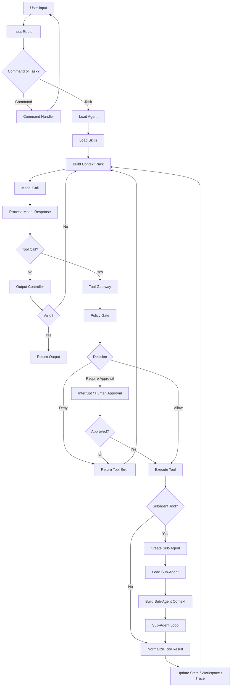

# Agent Harness 架构设计文档

## 1. 目标

构建一套基于 **LangChain + LangGraph** 的通用 Agent Harness，用于支撑 Agent 的定义、加载、执行、工具治理、上下文管理、权限控制、状态管理、产物管理与全链路追踪。

---

## 2. 架构总览

```text
Application
↓
Harness API
↓
Input Router
↓
Agent Loader
↓
Skill Loader
↓
Context Manager
↓
LangGraph Runtime
↓
Model Adapter / Tool Gateway
↓
Policy Gate
↓
Workspace / Trace / Output
```

---

## 3. 核心模块

```text
Agent Harness
├── Input Router
├── Agent Loader
├── Skill Loader
├── Context Manager
├── Runtime Adapter
├── Model Adapter
├── Tool Gateway
├── Policy Gate
├── Workspace Manager
├── Output Controller
└── Trace Recorder
```

---

## 4. 执行流程



---

## 5. Agent

### 5.1 定义

**Agent 是可执行角色。**

Agent 负责定义角色身份、任务边界、默认工具、默认 Skill、执行约束与输出要求。

### 5.2 文件形态

```text
agents/
└── case-reviewer.md
```

```markdown
---
name: case-reviewer
description: Review case facts, evidence consistency, and missing materials.
tools: read_case, read_evidence, search_law, write_draft
skills: evidence-gap-check, risk-labeling
---

You are responsible for case material review.

Responsibilities:
- Check fact-evidence consistency.
- Identify missing materials.
- Produce review drafts.

Constraints:
- Do not make final decisions.
- Do not modify official records directly.
- Do not invent facts.

Output:
- summary
- issues
- evidence_gaps
- risks
- next_actions
```

### 5.3 Agent Loader

职责：

```text
- 解析 Agent frontmatter
- 加载 Agent 指令
- 绑定默认 tools
- 绑定默认 skills
- 生成 Agent Profile
- 注入 Runtime State
```

---

## 6. Skill

### 6.1 定义

**Skill 是可加载能力包。**

Skill 不只是 Prompt，而是包含指令、Reference、脚本、模板、示例、工具绑定、Skill 依赖和输出约束的能力单元。

### 6.2 文件形态

```text
skills/
└── evidence-gap-check/
    ├── SKILL.md
    ├── references/
    ├── scripts/
    ├── templates/
    └── examples/
```

```markdown
---
name: evidence-gap-check
description: Check whether case facts are supported by available evidence.
allowed-tools: read_case, read_evidence, search_law
---

# Evidence Gap Check

Use this skill when a task requires fact-evidence consistency checking.

## Procedure

1. Extract key facts.
2. Map evidence to facts.
3. Identify unsupported facts.
4. Identify weak evidence.
5. Generate review suggestions.

## References

Use files under `references/` when classification or rule lookup is required.

## Scripts

Use scripts under `scripts/` for deterministic processing when available.

## Templates

Use templates under `templates/` for final output.

## Constraints

- Do not invent evidence.
- Do not treat statements as verified facts.
- Do not produce final decisions.
```

### 6.3 Skill Loader

职责：

```text
- 解析 SKILL.md
- 索引 skill description
- 根据任务动态加载 Skill
- 加载 references / scripts / templates / examples
- 控制 allowed-tools
- 支持 Skill 间调用
- 支持 Subagent 内加载
```

---

## 7. Context Manager

### 7.1 输入

```text
- Agent Profile
- Loaded Skills
- Task State
- Recent Messages
- Workspace Index
- Tool Descriptions
- Memory
- Output Contract
```

### 7.2 输出

```text
Context Pack
```

结构：

```text
System Instruction
Agent Instruction
Active Skill Instruction
Relevant References
Current State
Available Tools
Workspace Index
Recent Messages
Output Requirement
```

### 7.3 策略

```text
- Agent 常驻
- Skill 按需加载
- Reference 按需读取
- Tool 按需暴露
- 历史消息摘要化
- 大文件保留在 Workspace
- Subagent 上下文隔离
```

---

## 8. Runtime Adapter

### 8.1 定义

**Runtime Adapter 负责将 Harness 抽象转换为 LangGraph 执行图。**

### 8.2 标准 Runtime Graph

```text
START
↓
load_agent
↓
select_skills
↓
build_context
↓
agent_step
↓
route_response
↓
tool_gateway / output_controller
↓
policy_gate
↓
execute / interrupt
↓
update_state
↓
continue / END
```

### 8.3 State

```python
class AgentState(TypedDict):
    run_id: str
    parent_run_id: str | None
    agent_name: str
    task: dict
    messages: list
    loaded_skills: list
    tool_calls: list
    workspace_refs: list
    pending_approval: dict | None
    draft_output: dict | None
    final_output: dict | None
    trace: list
```

### 8.4 Runtime 职责

```text
- Agent Loop
- State Update
- Checkpoint
- Interrupt
- Resume
- Subagent 调度
- Step Limit
- Error Handling
- Termination Check
```

---

## 9. Model Adapter

### 9.1 定义

**Model Adapter 负责统一模型调用协议。**

### 9.2 职责

```text
- 消息格式适配
- Tool Call 格式适配
- Structured Output 适配
- Streaming 事件归一
- Retry / Repair
- Fallback
- Token 统计
- Cost 记录
```

### 9.3 基础依赖

```text
LangChain ChatModel
LangChain Structured Output
Model Gateway
```

---

## 10. Tool Gateway

### 10.1 定义

**Tool Gateway 是 LangChain Tool 的统一治理入口。**

### 10.2 调用链

```text
Model Tool Call
↓
Schema Validate
↓
Policy Gate
↓
Permission Check
↓
Idempotency Check
↓
Execute Tool
↓
Normalize Result
↓
Audit Log
↓
Return Result
```

### 10.3 Tool Spec

```text
name
description
input_schema
output_schema
risk_level
side_effect
allowed_agents
allowed_skills
timeout
retry
idempotent
```

### 10.4 风险等级

```text
L0 compute
L1 read
L2 draft_write
L3 business_write
L4 external_action
```

---

## 11. Policy Gate

### 11.1 定义

**Policy Gate 是强制执行控制层。**

### 11.2 检查对象

```text
Agent
Skill
Tool
User
Task
State
Action
Resource
Risk Level
```

### 11.3 决策类型

```text
allow
deny
require_approval
require_review
```

### 11.4 默认规则

```text
L0 / L1：allow
L2：allow to workspace / draft
L3：require_approval
L4：require_approval + audit
```

---

## 12. Subagent

### 12.1 定义

**Subagent 是由 AgentTool 创建的递归 Agent Runtime。**

### 12.2 执行链

```text
AgentTool
↓
Create Sub-Agent Run
↓
Load Sub-Agent
↓
Load Sub-Agent Skills
↓
Build Sub-Agent Context
↓
Sub-Agent Loop
↓
Return Final Result
↓
Parent Agent Context
```

### 12.3 约束

```text
- 独立 context
- 独立 state
- 独立 tool set
- 独立 skill set
- trace 归属同一 root_run_id
- 结果回写 parent workspace
```

---

## 13. Workspace Manager

### 13.1 定义

**Workspace 是 Agent 的任务工作区。**

### 13.2 结构

```text
workspace/
└── run_id/
    ├── input/
    ├── state/
    ├── references/
    ├── artifacts/
    ├── drafts/
    └── logs/
```

### 13.3 职责

```text
- 保存输入材料
- 保存中间产物
- 保存工具结果
- 保存草稿输出
- 保存引用文件
- 提供文件索引
- 支持版本记录
```

---

## 14. Output Controller

### 14.1 定义

**Output Controller 是最终输出闸门。**

### 14.2 检查项

```text
Schema
Required Fields
Citation
Risk Label
Forbidden Content
Draft / Final Boundary
Human Review Requirement
```

### 14.3 输出状态

```text
draft
validated
needs_review
final
rejected
```

---

## 15. Trace Recorder

### 15.1 定义

**Trace Recorder 记录完整执行链路。**

### 15.2 记录字段

```text
run_id
root_run_id
parent_run_id
agent
skill
model
context_hash
tool_call
tool_result
policy_decision
interrupt
approval
output
token_usage
latency
error
```

### 15.3 适配目标

```text
LangSmith
Langfuse
Phoenix
OpenTelemetry
Custom Trace Store
```

---

## 16. Harness API

```text
run_task(agent, input)
resume_task(run_id, input)
approve_action(run_id, approval_id, decision)
reject_action(run_id, approval_id, reason)
get_state(run_id)
get_artifacts(run_id)
get_trace(run_id)
```

---

## 17. 最小实现范围

```text
V0.1
├── Markdown Agent
├── Skill Package
├── LangChain Tool Registry
├── LangGraph Runtime
├── Context Manager
├── Policy Gate
├── Tool Gateway
├── Workspace Manager
├── Output Controller
└── Trace Recorder
```

---

## 18. 最终定义

```text
Agent Harness
= Agent Loader
+ Skill Loader
+ Context Manager
+ Runtime Adapter
+ Model Adapter
+ Policy Gate
+ Tool Gateway
+ Workspace Manager
+ Output Controller
+ Trace Recorder
```

**Agent Harness 是基于 LangChain + LangGraph 的 Agent 运行内核：以 Markdown 定义 Agent，以 Skill Package 扩展能力，以 LangGraph 控制执行，以 Policy Gate 约束边界，以 Tool Gateway 治理工具，以 Workspace 承载过程，以 Trace 记录全链路。**
